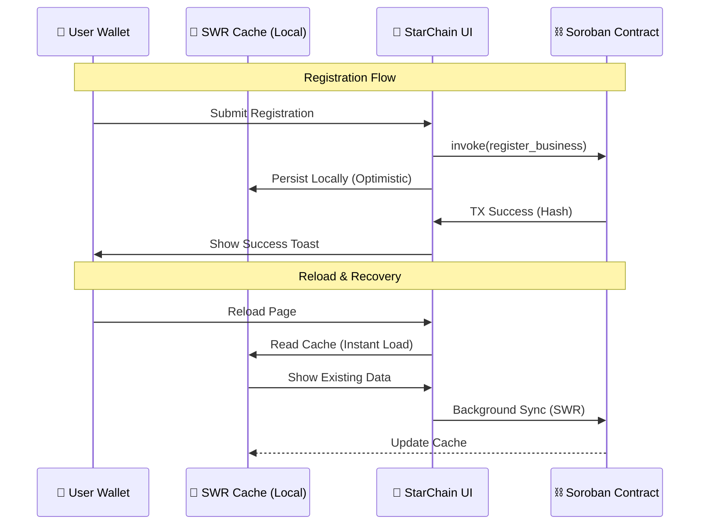

# StarChain System Architecture (Level 5)

## 🏗️ Overview
**StarChain** is a decentralized business reputation and merchant discovery platform. The architecture is designed to handle high-latency blockchain operations while providing a low-latency "Web2-style" user experience through advanced client-side caching and optimistic UI patterns.

---

## 🛠️ Core Components

### 1. Smart Contract Layer (Soroban / Rust)
The contract lives at: `CA43LPCXAPJQZYGKAKYKMIBL7WBOXWFY22ZCVTGTDRULIUHGHWXBXU6N`
- **Data Persistence**: Stores business metadata and reviews permanently on the Stellar Testnet.
- **Metadata Embedding**: Instead of large on-chain structs, we use **JSON Strings** to store complex data (images, menus, addresses). This reduces storage costs and increases contract flexibility without a redeploy.

### 2. SWR Caching Layer (Client-Side)
To solve the problem of blockchain latency, we implement **Stale-While-Revalidate (SWR)**:
- **Instant Response**: Data is served from `localStorage` immediately upon page load.
- **Background Sync**: The app triggers `loadChainDataSync()` to fetch the latest state from Soroban while the user is browsing.
- **Mutation Locking**: When a user registers a business or submits a review, the app immediately updates the local cache before the transaction is even confirmed on-chain.

### 3. AI Sentiment Engine
- **On-Chain Analysis**: The app provides a sentiment score based on the aggregate ratings and cryptographic signatures found on the ledger.
- **Reputation Logic**: Only reviews signed by a verified Stellar key contribute to a merchant's score, preventing "bot spam".

---

## 🔄 Interaction Flow



---

## 📂 Data Structures (Embedded JSON)

We use the following schema for business metadata stored in the `category` string of the contract:

```json
{
  "address": "Store #10, Gurugram, India",
  "image": "https://images.unsplash.com...",
  "ownerName": "Harshal Jagdale",
  "menu": [
     {"name": "Espresso", "price": "5 XLM", "emoji": "☕"},
     {"name": "Croissant", "price": "12 XLM", "emoji": "🥐"}
  ]
}
```

---

## ⚡ Performance Optimizations
- **Polling Interval**: Reduced from 2s to 500ms for faster transaction discovery.
- **Parallel Fetching**: Uses `Promise.all` for fetching business data and ratings concurrently.
- **Grid Layouts**: Mobile-first responsive grid using `repeat(auto-fill, minmax(280px, 1fr))`.
